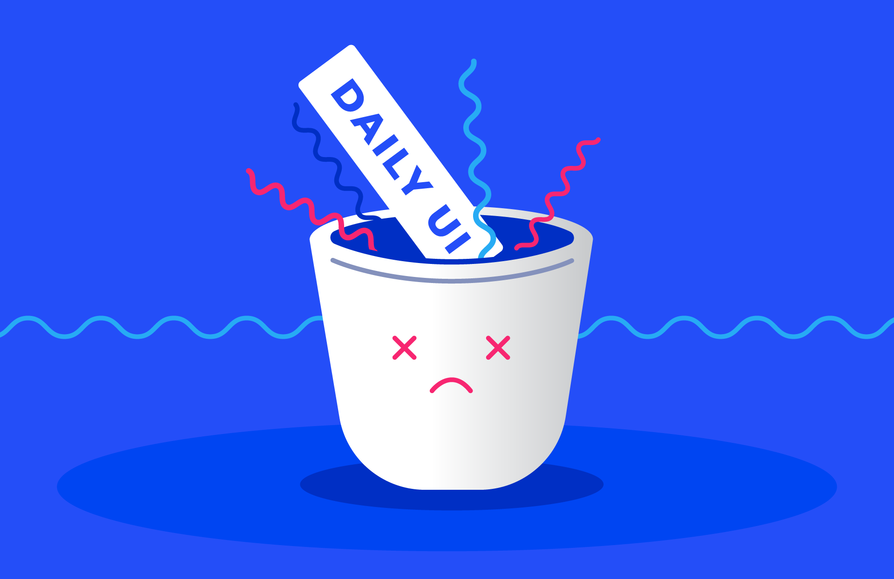
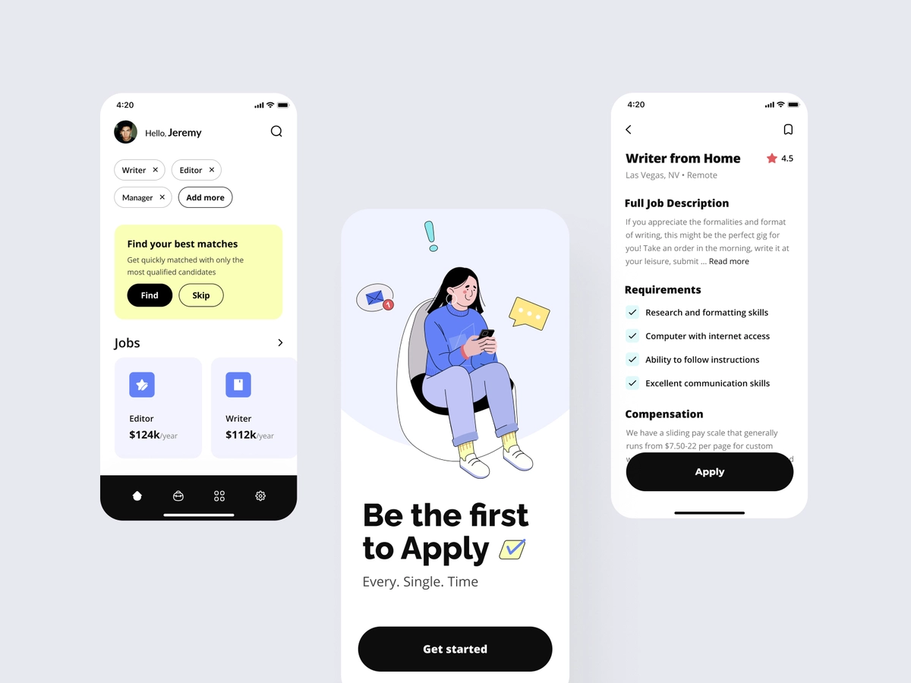

  

  

  
  
 

<h1 align="center">
    
</h1>

<h4 align="center"> 
	🚧  UI CHALLENGE 🚧
</h4>

## 💻 Expo UI Challenge

♻️ This challenge is about what I've implementation while remaking random ⛹️‍♂️ Dribbble mobile UI

---

## 🎨 Layout

### Dribbble

  

### Result

  <!--  -->

---
